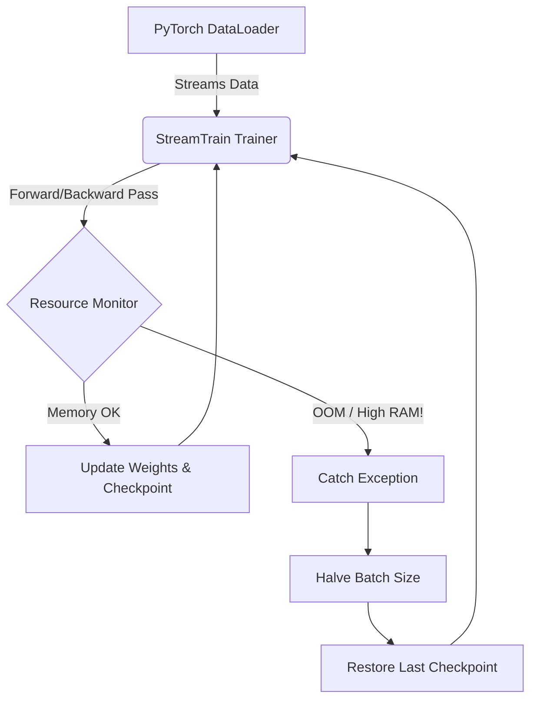
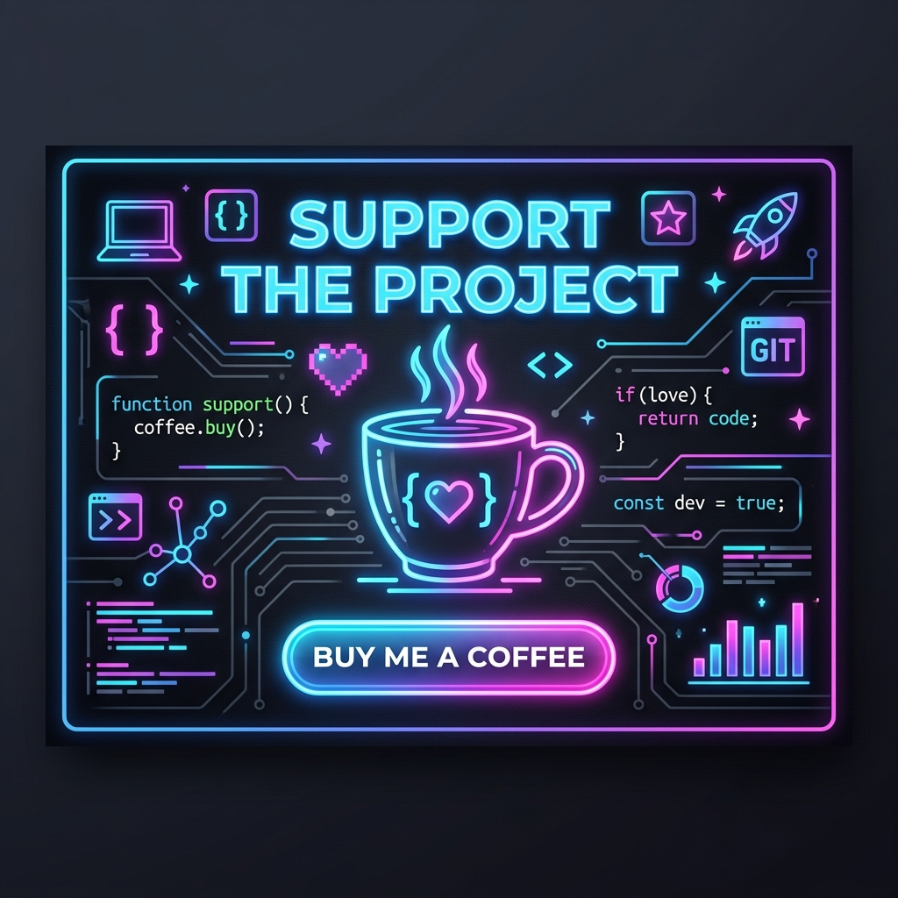

<div align="center">
  <h1>🚀 StreamTrain</h1>
  <p><b>Resource-aware, streaming, resumable AI training for PyTorch on constrained hardware.</b></p>

  [](https://opensource.org/licenses/Apache-2.0)
  [](https://www.python.org/downloads/)
  [](https://pytorch.org/)
</div>

<br>

> **Note**: Add a screenshot or GIF of the `streamtrain monitor` CLI in action here!
> 
> *<p align="center">Screenshot placeholder: Terminal showing `streamtrain monitor` with live RAM/VRAM usage scaling up and down.</p>*

## The Problem
Training deep learning models usually assumes a server environment with massive RAM, VRAM, and fast storage. On ordinary laptops or desktop machines, attempting to train or fine-tune models often leads to out-of-memory (OOM) crashes, system freezes, and lost progress. 

## The StreamTrain Solution
StreamTrain is a lightweight PyTorch framework designed for constrained hardware. Instead of loading your entire dataset into RAM, StreamTrain relies on dataset streaming, robust checkpointing, and dynamic batch size optimization to keep resource consumption inside strict boundaries. 

If an OOM exception occurs, StreamTrain gracefully halves the batch size, restores the last valid checkpoint, and continues training—all automatically.

## Quick Start

```bash
pip install -e .
```

Write a configuration file `config.yaml`:
```yaml
model:
  name: my_model

training:
  epochs: 10
  batch_size: 64 # Or "auto" for auto-scaling
  gradient_accumulation: 4
  precision: fp32

resources:
  mode: laptop
  max_ram: 4GB
  max_vram: 2GB
  max_cpu_percent: 80

checkpoint:
  directory: ./checkpoints
  interval_steps: 100
  keep_last: 3

logging:
  directory: ./logs
  interval_steps: 10
```

Integrate with your PyTorch code:

```python
from streamtrain import Trainer, StreamTrainConfig

config = StreamTrainConfig.from_yaml("config.yaml")

trainer = Trainer(
    model=my_pytorch_model,
    optimizer=my_optimizer,
    dataset=my_dataset, # Or an IterableDataset
    config=config,
    device="cuda"
)

trainer.train()
```

## Features
- **Dataset Streaming**: Transparently handles PyTorch Datasets and IterableDatasets without blowing up your RAM.
- **Auto OOM Recovery**: Catch PyTorch CUDA OOM errors (and system RAM thresholds) to automatically scale down the batch size and restore the last valid step.
- **Gradient Accumulation**: Get large effective batch sizes without needing VRAM.
- **Atomic Checkpointing**: Interrupt at any time (Ctrl+C, power loss) and safely resume.
- **Resource Monitoring**: Monitor your system RAM, CPU, and GPU VRAM usage.

## 🛠️ How It Works (Architecture)

StreamTrain dynamically monitors your system resources during the training loop. If an Out-Of-Memory (OOM) error or high resource usage is detected, it automatically catches the exception, scales down the batch size, and resumes from the last valid checkpoint.



StreamTrain wraps the PyTorch standard components `DataLoader`, `Optimizer`, and `Model`. It injects monitoring via `BatchSizeOptimizer`, atomic persistence via `CheckpointManager`, and resource tracking via `ResourceMonitor`.

## Examples
Check the `examples/` directory for a synthetic dataset example that demonstrates the full training loop, check-pointing, and resume capabilities.

Run the synthetic example:
```bash
python examples/synthetic_train.py
```
Resume from interruption:
```bash
python examples/synthetic_train.py --resume
```

## CLI Usage
StreamTrain provides a CLI for managing and monitoring resources:
```bash
# Check system information and resources
streamtrain system-info

# Live monitor RAM and VRAM limits
streamtrain monitor
```

## Limitations
StreamTrain does **not**:
- Automatically split models across multiple devices (model parallel).
- Magically create hardware capabilities that do not exist; training speed is bounded by the underlying compute.

## Contributing
Contributions are welcome. Please read `CONTRIBUTING.md` (coming soon) and feel free to open PRs for integrations like Hugging Face Datasets or advanced checkpoint formats (safetensors).

## License
Apache-2.0 License.

---
<div align="center">
  <h3>☕ Support the Project</h3>
  <p>If StreamTrain helped you train models on your laptop without crashing, consider buying me a coffee!</p>
  <a href="https://www.buymeacoffee.com/azlanabdulla" target="_blank">
    
  </a>
</div>
